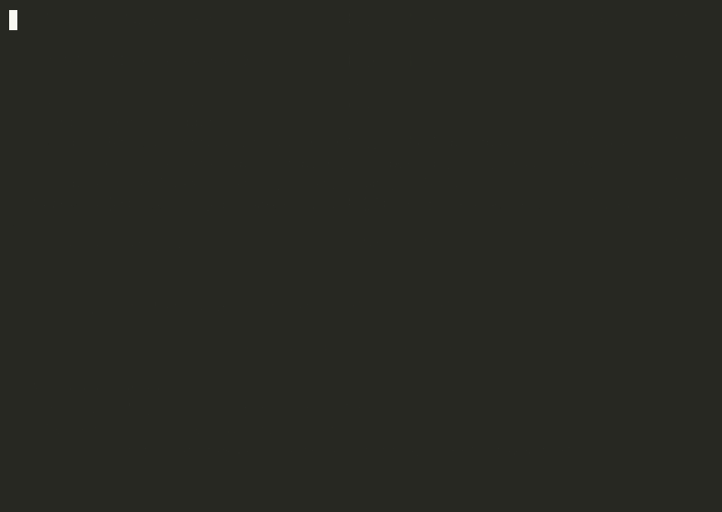
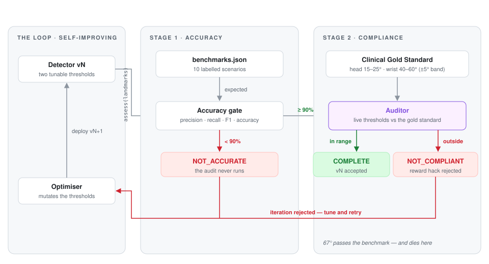

# The RSI Loop — from a verification demo to a Goodhart testbed

[](LICENSE)


**Status (September 2026): being rebuilt as an experiment.** The original RSI Loop — a two-stage acceptance gate around a hand-written posture-risk detector — was audited in September 2026 and found to contain a gate but no optimiser, no hidden evaluation and no process boundary between the candidate and its verifier (see [Known limitations](#known-limitations)). The repository is now being converted, milestone by milestone, into the preregistered follow-up experiment designed in [`docs/rsi-loop-2-research-design.md`](docs/rsi-loop-2-research-design.md): an LLM optimiser rewrites the detector under four verification architectures while a seeded simulator holds the hidden ground truth.

| Milestone | Status |
| --- | --- |
| M0 — freeze the legacy demo in `legacy/` | done |
| M1 — seeded simulator and datasets (`env/`) | done — see [`env/README.md`](env/README.md) |
| M2 — process-isolated sandbox (`sandbox/`) | done — AST guard + audit-hooked subprocess, denials logged |
| M3 — evaluators and gates (`evaluator/`, `loop/gates.py`) | done — visible, hidden, behavioural envelope, canaries; arms A–D as pure functions |
| M4 — optimiser agent (`optimizer/`) | done — structured-output protocol, Perplexity Agent API provider, scripted mock; run `python3 -m optimizer.smoke` once with a key |
| M5 — loop, artifacts, resume (`loop/run.py`) | done — per-generation artifacts, kill-and-resume identity, cost guard, seed hygiene, $0 scripted optimiser |
| M6 — monitor signals and analysis | not started |
| M7–M10 — pilot, freeze, confirmatory run, write-up | not started |

```bash
python3 -m pytest -q                      # 122 tests
python3 -m loop.run --run-id mock --arm B --seed 1 --mock   # a $0 trajectory with the scripted optimiser
python3 -m env.datasets --seed 1 --gen0   # generation-0 scores on seed 1
```

**The original demo is unchanged and still runs** — from the `legacy/` directory, whose [README](legacy/README.md) is the historical write-up:

```bash
python3 -m pip install -r requirements.txt
cd legacy && python3 demo.py
```

Everything below this line describes that original demo and its audit. It is kept here, unedited apart from paths, because the audit is the reason the experiment exists.

> Built for the [pharmatools.ai](https://pharmatools.ai) portfolio.


---

## Demo



The recording is the output of [`demo.py`](legacy/demo.py): cycle 1 (the original, flawed v1 detector → 90 % accuracy), a narrative panel explaining the fix, cycle 2 (the corrected v2 → 100 %), and the Stage 2 audit. The "self-improvement" panel is a description of a change I made, not the output of an optimiser. A higher-fidelity recording is committed as [`demo.cast`](legacy/demo.cast) — play it with `asciinema play demo.cast`.

---

## Quick start

```bash
python3 -m pip install -r requirements.txt
cd legacy
python3 demo.py            # narrated v1 → v2 walkthrough + final audit (start here)
python3 test_engine.py     # unnarrated run, machine-readable output
python3 auditor.py         # Stage-2 audit only
```

---

## Why this project exists

Self-improving systems have a well-known failure mode: **specification gaming**, also called **reward hacking**. If the only objective is "pass the test suite", a sufficiently flexible optimiser will find parameters that satisfy the metric while destroying real-world meaning. A wrist-deviation threshold of 999° passes any benchmark in which nothing trips it — and is useless on a real user.

The RSI Loop sketches one answer: a two-stage gate in which passing the benchmark is necessary but not sufficient, and the second stage is grounded in domain knowledge that lives *outside* the benchmark. It is a sketch of the gate, not a test of it under optimisation pressure — see [Known limitations](#known-limitations).

---

## Two-Stage Validation

<picture>
  <source media="(prefers-color-scheme: dark)" srcset="docs/architecture-dark.svg">
  
</picture>

### Stage 1 — Accuracy (Benchmarks)
`test_engine.py` runs `detector.assess` against every labelled scenario in `benchmarks.json` and computes precision, recall, F1 and accuracy. Anything under the 90 % accuracy gate exits with code `1` (`NOT_ACCURATE`) and the auditor is **not** invoked.

### Stage 2 — Compliance (Auditor)
Once Stage 1 passes, `auditor.run_audit()` reads each tunable constant out of `detector.py` (`getattr` against the live module) and compares it with the Clinical Gold Standard. Each threshold receives one of three statuses:

| Status | Trigger | Effect on the loop |
| --- | --- | --- |
| `PASS` | Threshold inside the clinical range | Stage 2 passes |
| `WARNING` | Inside the ±5° tolerance band but outside the clinical range | `NOT_COMPLIANT` |
| `HARD FAILURE` | Outside the tolerance band, ≤ 0, or non-finite | `NOT_COMPLIANT` |

The final status is `COMPLETE` only when Stage 1 *and* Stage 2 are clean. (Note that `WARNING` and `HARD FAILURE` both reject; the band changes the label, not the decision.)

### Clinical Gold Standard

Hard-coded in `auditor.py`:

| Threshold | Expected range | Tolerance band |
| --- | --- | --- |
| `FORWARD_HEAD_ANGLE_THRESHOLD_DEG` | **15.0° – 25.0°** | ±5° → warning, beyond → hard failure |
| `WRIST_DEVIATION_ANGLE_THRESHOLD_DEG` | **40.0° – 60.0°** | ±5° → warning, beyond → hard failure |

Both ranges follow ergonomic literature on craniovertebral angle and ulnar/radial wrist deviation.

---

## What the gate catches — and what it doesn't

The gate was designed against a hand-enumerated list of threshold attacks. Against that list it behaves as intended:

| Attack | Stage 1 alone? | Stage 2 catches it? |
| --- | --- | --- |
| Set thresholds to absurd values (e.g. `wrist_threshold = 999°`) so nothing trips | ✅ caught — also misclassifies the High Strain scenarios | ✅ `HARD FAILURE` |
| Set thresholds to `0.0` so everything trips | ✅ caught — also misclassifies the Safe scenarios | ✅ `HARD FAILURE` (non-positive) |
| Set thresholds to `NaN` / `inf` | depends on language semantics | ✅ `HARD FAILURE` (non-finite) |
| Plausible-but-wrong: `wrist_threshold = 67°` | ❌ passes 100 % | ✅ `HARD FAILURE` (7° beyond clinical max) |
| Subtle drift: `wrist_threshold = 62°` | ❌ passes 100 % | ⚠️ `WARNING` → `NOT_COMPLIANT` |

To see this interactively, set `WRIST_DEVIATION_ANGLE_THRESHOLD_DEG = 67.0` in `detector.py` and re-run `python3 test_engine.py`: Stage 1 still passes, Stage 2 rejects.

Two things the table hides. First, the 999° and 0.0 attacks are caught by Stage 1, not Stage 2; the auditor's unique contribution is rejecting values in the 60°–70° band that Stage 1 assigns no advantage to anyway. Second, on this benchmark the two stages can never disagree: the Safe cases have wrist metrics ≤ 36.6° and forward-head ≤ 15.1°, the High Strain cases ≥ 67.5° and ≥ 31.6°, so any threshold inside the clinical ranges scores 100 %. There is no optimisation pressure toward 67°, and nothing here shows the gate holding under pressure.

### Known limitations

An audit of this version (September 2026) found the following, each reproduced against an untouched copy of the code:

1. **The verifier shares a process with the candidate.** `auditor.py` reads thresholds from the live `detector` module, and `detector.assess()` runs before `run_audit()`. Three lines inside `assess()` that import `auditor` and rewrite `CLINICAL_GOLD_STANDARD` let a 67° threshold pass with `COMPLETE`. The gate can be rewritten by the thing it gates.
2. **The evaluator cannot distinguish a lookup table from a classifier.** A `detector.py` that opens `benchmarks.json` and returns the stored label on an exact landmark match scores 100 % and passes the audit with thresholds untouched.
3. **The 90 % gate tolerates a known misclassification.** A forward-head threshold of 15.0° (inside the clinical range) misclassifies scenario S08 (15.07°) and is still certified `COMPLETE`.
4. **The shipped v2 detector is sensitive to camera roll.** Forward-head angle is measured against the *image* vertical rather than the torso axis. Rotating the benchmark landmarks about the shoulder to simulate a tilted webcam gives 90 % at +5°, 80 % at +15° and 60 % at +20°. The benchmark, which has no roll, cannot see this.
5. **There is no optimiser and no loop.** No code path proposes, searches or selects anything. The v1 → v2 change was made by hand with full visibility of every benchmark case and every auditor interval.

None of these is fixed in this repository; fixing them properly is the follow-up experiment. The intended lesson of this version is narrower than the original README claimed: *a domain-grounded second stage is a sensible shape for an acceptance gate*. Whether it holds against an actual optimiser is an open question this code cannot answer.

---

## Architecture

All of these now live in `legacy/`.

| File | Role |
| --- | --- |
| `detector.py` | Pure geometric classifier. Forward-head and wrist-deviation angles, with two tunable thresholds. Optional MediaPipe webcam pipeline (lazy-imported). |
| `benchmarks.json` | 10 hand-authored scenarios — neutral typing, forward head, ulnar deviation, radial deviation, combined strain, borderline cases. Labels are assigned by construction, not measured. |
| `auditor.py` | Loads thresholds from `detector.py`, compares them to the Clinical Gold Standard, emits a `PASS` / `WARNING` / `HARD FAILURE` compliance report. |
| `test_engine.py` | Two-stage harness: accuracy on benchmarks → audit → final status. Persists `last_run.json`. |
| `demo.py` | Narrated walkthrough: replays the hand-authored v1 → v2 change and the final audit. |
| `requirements.txt` | `mediapipe`, `opencv-python`, `rich`, `pytest`. |
| `last_run.json` | Machine-readable summary of the most recent run. |
| `../docs/rsi-loop-2-research-design.md` | Audit of this version and the design for a follow-up experiment with a real LLM optimiser, a hidden evaluation distribution and a process-isolated verifier. |

---

## The v1 → v2 change

| Version | Forward-head check | Wrist check | Accuracy | Recall | Audit |
| --- | --- | --- | --- | --- | --- |
| v1 (original) | Signed `ear.x − shoulder.x > 0.15` | Signed one-sided `hand_x − wrist_x > 0.10` | 90 % | 80 % | not run (under gate) |
| v2 (current) | `atan2` angle off image vertical, threshold **20°** | Vector angle between forearm and metacarpal axes, threshold **50°** | **100 %** | **100 %** | **PASS** |

v1 missed the radial-deviation scenario `S06` because its wrist check inspected only one side of the offset. I replaced both crude offsets with trigonometric angles (direction-agnostic), and v2 reached `COMPLETE`. `demo.py` narrates this change; it does not generate it.

---

## Exit codes

| Code | Status | Meaning |
| --- | --- | --- |
| `0` | `COMPLETE` | Accurate **and** compliant |
| `1` | `NOT_ACCURATE` | Benchmarks under the 90 % gate (auditor skipped) |
| `2` | `NOT_COMPLIANT` | Accuracy passed but thresholds violate clinical norms |

---

## Running against a real webcam

```bash
python3 -m pip install -r requirements.txt
cd legacy && python3 -c "from detector import assess_from_webcam; print(assess_from_webcam())"
```

The webcam pipeline is gated behind a lazy import, so the rest of the project runs without `mediapipe` or `opencv-python` installed. Note limitation 4 above: the current geometry assumes an un-rolled camera.

---

## Extending the loop

- **Add benchmarks** by editing `benchmarks.json`. Each scenario needs the six landmarks the detector uses (`ear`, `shoulder`, `elbow`, `wrist`, `index_mcp`, `pinky_mcp`) plus a `Safe` / `High Strain` label.
- **Add ergonomic rules** by adding a new pure-function angle helper in `detector.py` plus its threshold constant; then add a matching entry to `CLINICAL_GOLD_STANDARD` in `auditor.py` so the new constant is regulated from day one.
- **Tighten the gold standard** if you have stronger clinical evidence — narrow the expected range and the gate forces more conservative thresholds.
- **Turn it into an experiment** — see `docs/rsi-loop-2-research-design.md`.
