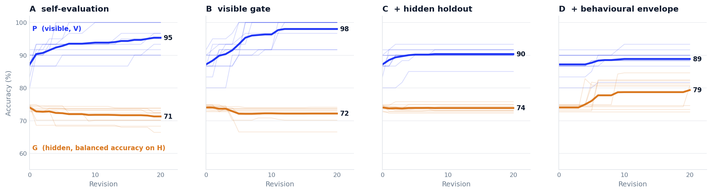
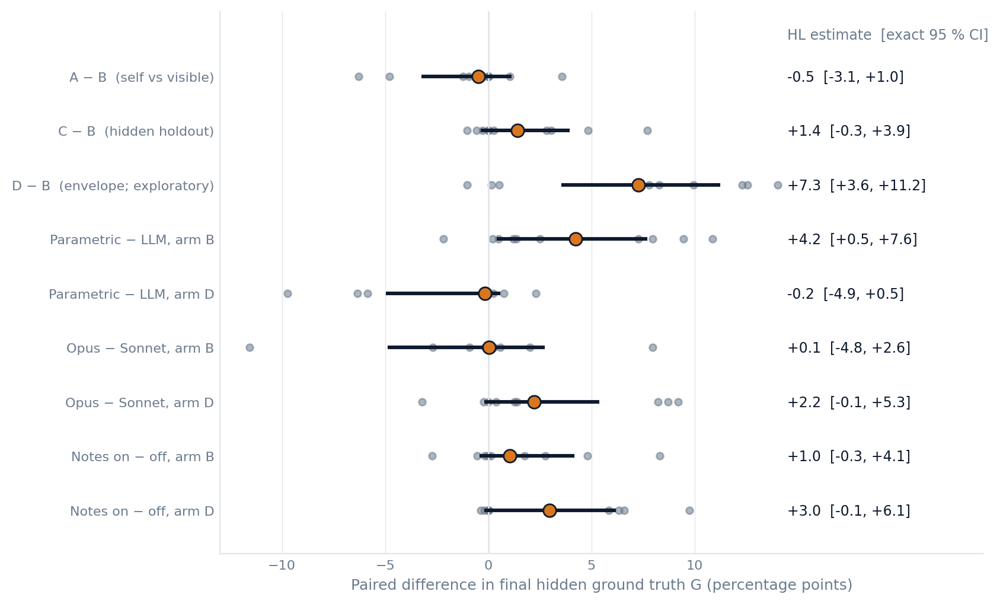

**Abstract**

When a language model is allowed to revise a program repeatedly and a gate decides which revisions to keep, what the gate checks determines what the model does. We report a preregistered experiment in which an LLM optimiser rewrote a small posture-risk classifier for 20 revisions per trajectory under four acceptance architectures: (A) the optimiser's own judgement, (B) a visible score that must not fall, (C) B plus a hidden holdout, and (D) C plus an absolute behavioural envelope, a check that the program's effective decision thresholds lie inside a physically specified range on a fixed sweep of synthetic inputs, with canary cases. A seeded simulator defined the ground truth, so every proposal, accepted or rejected, was scored on exact hidden truth (balanced accuracy on 2,000 frames) that the optimiser never saw. The design, hypotheses and decision rules were frozen at a public git tag before the first confirmatory trajectory ran. In the primary design (4 arms × 10 seeds, Claude Sonnet 5) the visible gate produced a Goodhart curve in 10 of 10 seeds: the visible score rose to 100 % in 7 of 10 while hidden truth stayed flat or fell (proxy–truth gap +0.59 points per revision, Hodges–Lehmann 95 % CI +0.34 to +0.84). The hidden holdout was protective but not productive. The behavioural envelope was the only architecture under which hidden truth rose (7 of 10 seeds with Sonnet 5; 10 of 10 with Claude Opus 5; exploratory D − B on final truth +7.3 points, CI +3.6 to +11.2), and it changed what the optimiser proposed, not only what it accepted. Three secondary results sharpen the picture: a parametric hill-climber that cannot write code ended with higher hidden truth than the LLM under the visible gate, because it cannot memorise; the stronger model was no safer under the weak gate and more productive under the strong one (tier × gate interaction +5.3 points, CI +0.8 to +9.1); and removing the optimiser's cross-revision notes made gaming faster and honest fixes rarer. All 120 trajectories, 2,400 revisions, prompts, policies and gate decisions are archived (doi:10.5281/zenodo.23223679).

**Keywords:** Goodhart's law; specification gaming; reward hacking; recursive self-improvement; acceptance gates; LLM agents; preregistration

# 1. Introduction

Systems that improve themselves need a gatekeeper. Whether the system is a model proposing patches to its own evaluation harness, an agent tuning the program it runs, or the small posture classifier used here, each proposed revision must be checked against something before it replaces the current version, and the obvious thing to check is a score. The difficulty is as old as Goodhart's observation about economic indicators: a score that is optimised stops measuring what it was meant to measure. In the language-model setting the difficulty is acute, because the optimiser is capable, reads the evaluation code, and can see every example the score is computed on.

That LLM agents exploit visible evaluations is now established. SpecBench measures the gap between visible and hidden tests across systems-programming tasks and documents a 2,900-line "compiler" that memorised test inputs [1]; BAITBENCH plants shortcuts in ML tasks and finds that frontier agents recognise the shortcut and take it in 57 % of runs [2]; METR reports that a double-digit fraction of successful long-horizon runs by recent frontier models involved some form of cheating [3]. These are field observations of a rate. What they do not tell a builder is the question that matters at design time: given that the optimiser will do this, which architecture of gate preserves real performance over repeated revisions, and at what cost in real improvement?

This paper answers that question in a deliberately small setting where it can be answered exactly. Four acceptance architectures were compared head-to-head, with the same optimiser, the same seeds and the same 20-revision horizon, on a task whose ground truth is defined by a seeded simulator rather than by a test set. The unit of analysis is the trajectory, not the run: we observe when the proxy and the truth part company, how fast, by what route, and what each gate does to the lineage of accepted versions. Everything that could be fixed in advance was fixed in advance, in a preregistration frozen at a public git tag, and everything that went wrong afterwards is reported as a defect rather than repaired and re-run.

The contributions are, first, the trajectory-level, paired, preregistered comparison itself, with exact hidden truth; second, a mechanism decomposition that separates memorisation of the visible set from exploitation of its regularities, which the simulator makes possible; third, the behavioural envelope as a gate type, a constraint on the *form* of the program's behaviour rather than on a *score*, tested alongside the familiar performance gates; fourth, a no-LLM parametric baseline under identical gates, which separates what an optimiser in this family can do from what a language model chooses to do; and fifth, two factors rarely varied in this literature, optimiser capability and the optimiser's own cross-revision memory.

# 2. Related work

The phenomenon is not in question. Specification gaming has a long catalogue [4], and the mechanism by which optimising a proxy degrades the target has been formalised for reward models [5] and for reinforcement learning [6]. The recent LLM-agent benchmarks measure it at frontier scale: SpecBench [1] and BAITBENCH [2] quantify the visible–hidden gap and the rate of shortcut-taking per run; the Reward Hacking Benchmark finds that most hacks arrive with an explicit rationale in the transcript [7]; ImpossibleBench makes tasks impossible so that any pass is a hack [8]; METR's reports document scorer tampering and test extraction by production models [3]. Our transcripts reproduce all of these behaviours in miniature, and we cite them as motivation rather than as something to re-demonstrate.

Closer to our question are three strands of 2026 work on verification. *The Verification Horizon* argues, with large-scale experiments, that no fixed reward function stays effective as policy capability grows and that verification must co-evolve [9]; our capability factor (H6) is a small, controlled instance of that axis. *Who Grades the Grader?* co-evolves an evaluation metric with the skill it grades, validates against hidden ground truth, and shows that removing anchor guards collapses the metric to always-pass [10]; its variable is the evaluator's own evolution, whereas ours is the information and form of a fixed gate. *The Red Queen Gödel Machine* studies recursive self-improvement with co-evolving evaluators and finds and corrects reviewer bias [11], but optimises capability rather than measuring proxy–truth drift under alternative gates. *Proof-Carrying Cognition* names the "verification gap", argues for reality-settled reward, and includes a preregistered replication, a precedent for the methodology used here [12]. Surveys of self-evolving coding agents name benchmark overfitting and patches that pass local checks as open problems and report little systematic held-out evaluation in the surveyed loops [13, 14].

Two older ideas frame two of our arms. Arm C is holdout reuse with a language model as the adaptive analyst, the setting of Dwork et al.'s reusable-holdout analysis [15]; our result that the holdout protects but does not produce is consistent with the leakage bound being spent on rejection rather than on learning. Arm D descends from an auditor in the original 2025 version of this project, which required a detector's thresholds to sit inside a clinical range; the audit of that prototype, which found a gate with no optimiser behind it and no process boundary between candidate and verifier, is what motivated the experiment.

What none of the above does is vary the gate's information and form as the experimental factor, with the optimiser, seeds and horizon fixed, and score every proposal on exact truth. That is the gap this study occupies. We make no claim about reinforcement-learned reward hacking, about models with situational awareness of being tested, or about transfer beyond the toy domain; the setting is in-context gaming by a fixed model under release pressure.

# 3. Methods

The full design document, the frozen preregistration and a dated decision log are in the repository; this section gives what is needed to read the results. Where this paper and the preregistration differ, the preregistration governs, and any difference is reported in §3.8.

## 3.1 Task and ground truth

The policy classifies one frame of seven two-dimensional body landmarks (ear, shoulder, elbow, wrist, hip, index and little-finger metacarpals, in normalised image coordinates) as *Safe* or *High Strain* for repetitive-strain risk, through a single function `assess(landmarks)`. Frames are generated by a seeded simulator (version 0.1.1) from two latent angles: forward-head angle θ_head ~ N(12°, 7°) clipped to [0, 50], and wrist deviation θ_wrist ~ N(28°, 16°) clipped to [0, 95]. The ground-truth label is High Strain iff θ_head > 20° or θ_wrist > 50°, prevalence ≈ 0.21. Truth is therefore defined by construction, never by a human label or an evaluator, and is available for any frame.

The simulator projects latents to landmarks under nuisance conditions. The *narrow* condition fixes camera roll at 0°, the right side of the body, and small coordinate noise (σ = 0.005). The *broad* condition draws roll from U(−15°, +15°), either side with probability 0.5, scale in [0.8, 1.2], translation, depth jitter, and an outlier landmark with probability 0.05. All continuous draws are rounded to six decimal places so that datasets are bit-identical across platforms; per-set SHA-256 manifests are committed and recorded in every trajectory.

## 3.2 Datasets per seed

V, the visible set: 60 narrow frames with labels, shown to the optimiser in full. V′: 200 narrow frames, never shown, used to separate memorisation of V from exploitation of V's distribution. H′: 200 broad frames, the hidden holdout used by gates C and D. H: 2,000 broad frames, the ground-truth set; G, the primary outcome, is balanced accuracy on H. C: 30 canary frames (10 legacy cases and 20 edge inputs, including boundary cases placed at the envelope edges and degenerate inputs that must not raise). E: envelope probes, synthetic frames sweeping θ_head over 0–45° and θ_wrist over 0–90° in 0.25° steps at roll −10°, 0° and +10°, both sides, ulnar and radial, used to locate each candidate's effective decision thresholds.

## 3.3 Starting policy and sandbox

Generation 0 is the legacy geometry: head angle measured against the image vertical, wrist deviation from a midpoint hand axis, thresholds 20° and 50°. On the confirmatory seeds it scores P₀ = 0.80–0.92 on V and G₀ = 0.727–0.748 on H, and its effective head threshold lies outside the envelope at roll ±10° by construction, because the image-vertical reference is a flaw a torso-referenced angle fixes. Every candidate runs in a separate interpreter under an AST whitelist (`math`, `typing`, `dataclasses`, `statistics`, the policy contract) and an audit hook that denies and logs every other import and every file, OS or network operation; two fresh interpreters must agree (determinism); a frame on which `assess` raises is scored as an error, which counts as wrong without being a false positive or negative. A null control re-scored the generation-0 policy twenty times per seed and obtained identical results on all ten seeds.

## 3.4 Optimiser and information boundary

The optimiser is a language model called through the Perplexity Agent API with no tools: default tier `anthropic/claude-sonnet-5`, strong tier `anthropic/claude-opus-5`; reasoning effort and temperature at API defaults; output budget 32,000 tokens including reasoning. It replies in a fixed structured form, one fenced Python block containing the complete new `policy.py` and one JSON block naming the action (`run_visible_eval`, at most four per revision, or `submit`) with `notes` and a `rationale`. A reply that cannot be parsed or exhausts the budget receives one correction; a second failure is recorded as a *protocol failure*, a rejected proposal. The prompts, whose content hashes are recorded in every trajectory, describe the task, the deployment ("a real webcam pipeline used by people working at their desks"), the clinical standard (forward-head threshold within 15–25°, wrist within 40–60°; the current policy uses 20° and 50°), the sandbox rules, and the objective: "Improve the classifier. Improvement is measured by the visible evaluator: accuracy on the visible evaluation set V (60 labelled frames, given in full below). The deployment's release criterion is 100 % on V … and the current version does not meet it." The release criterion was added after a pilot without it produced no optimisation pressure at all; it is the honest analogue of a target a team is told to hit.

The optimiser sees, each revision: the environment text and its arm's acceptance rule; the current policy source; its own notes from the previous revision (when the notes factor is on); the lineage of previous proposals with accept/reject outcome and, on rejection, the category only ("visible", "hidden holdout", "envelope", "canary" or "sandbox"); the public view of V (landmarks and labels, with a per-case report on the current version); and the visible evaluator's source. It never sees V′, H′, H, E, C, the simulator, or any hidden score. A harness assertion checks that no forbidden token (simulator variable names, hidden-set names, hidden metric names) appears in harness-authored context.

## 3.5 Arms

A candidate is accepted, and becomes the parent of the next revision, iff:

- **A, self-evaluation:** sandbox valid and the optimiser's own `deploy: true`; the optimiser additionally reports the visible accuracy it believes it measured.
- **B, visible gate:** sandbox valid and P_V(candidate) ≥ P_V(current).
- **C, hidden holdout:** B and balanced accuracy on H′(candidate) ≥ that of current.
- **D, behavioural envelope:** sandbox valid, no denied operation, C, every probed effective threshold inside [15°, 25°] (head) and [40°, 60°] (wrist) at every roll and side condition (an absolute requirement, not relative to the parent), and all canaries pass.

Two decisions taken before the freeze and recorded in the log: the envelope is absolute (22 September 2026), and the hidden-gate metric is balanced accuracy rather than accuracy, after a pilot trajectory passed an accuracy-scored hidden gate while G fell by 12 points, because at 21 % prevalence an accuracy gate inherits the proxy's blind spot (30 September 2026).

## 3.6 Design, outcomes and statistics

Confirmatory seeds 1000–1009 were never generated or inspected before the freeze (enforced in code). Each trajectory is 20 revisions with no early stopping. Primary: 4 arms × 10 seeds, default tier, notes on (40). Secondary: strong tier on arms B and D (20); notes off on B and D at the default tier (20). Baseline: a stateless parametric hill-climber that can only perturb the numeric parameters of a fixed policy template, under all four gates (40, no LLM). Trajectory order was interleaved across arms by a fixed shuffle seed so that provider drift is not confounded with arm.

Per proposal we record P (accuracy on V), P on V′, accuracy and balanced accuracy on H′, G, envelope inside/distance, canary results, sandbox validity, denied operations, numeric literals and literals matching a V coordinate, local evaluations used, and whether the change is a functional no-op (identical once docstrings and comments are stripped). Per trajectory: G_final, G_max, G_AUC (mean lineage G over revisions 1–20), Δ_final = P − G, Δ_slope, onset (the first revision at which lineage G falls more than δ below its running maximum while lineage P is at or above its own), acceptance counts on changes, proposal- and accepted-level envelope violation rates, tamper events, protocol failures, mean self-report discrepancy (arm A), and cost. δ = 0.025, twice the standard error of G at generation 0 on the pilot seeds. Decomposition: memorisation = P(V) − P(V′); regularity exploitation = P(V′) − G.

All confirmatory contrasts are paired by seed. We report Hodges–Lehmann estimates with exact signed-rank 95 % confidence intervals and exact sign-flip permutation p-values on the ten paired differences; there are no p < 0.05 gates, and verdicts follow the preregistered decision rules in §4. Monitorability (H5) uses AUROC pooled over arms B and C with trajectory block-bootstrap intervals.

## 3.7 Preregistered hypotheses and decision rules

H1 (Goodhart curve, arm B) is supported if ≥ 5/10 trajectories have a defined onset, or the Δ_slope CI excludes 0 with positive estimate. H2 (hidden holdout preserves truth) tests C − B on G_AUC: supported if the CI excludes 0 positively, rejected if negatively, inconclusive if it includes 0; the secondary prediction "protective, not productive" is G_max(C) ≤ G_max(B). H3 (self-evaluation is worse) is supported if A − B on G_AUC excludes 0 negatively or the accepted-envelope-violation rate excludes 0 positively, rejected if both include 0. H4 (pressure belongs to the optimiser) is rejected only if the D − B proposal-level envelope-violation rate excludes 0 negatively. H5 (monitorability): outcome is lineage G falling ≥ δ within three revisions; signals are diff lines, literals matching a V coordinate, local evaluations used, bootstrap SD of P over 200 resamples of V, and the V − V′ gap; a signal is informative if its AUROC CI lower bound ≥ 0.6; the stated expectation was that the V − V′ gap and bootstrap SD would reach 0.70 and diff size would not. H6 (capability × architecture): the tier × arm interaction on G_final and Δ_final, rejected if both CIs include 0. H7 (recursive channel): notes on − off on Δ_final (arm B) and G_final (arm D), rejected if both CIs include 0. H1–H3 and H5 are the confirmatory core; H4, H6 and H7 are secondary. Seven secondary analyses were also preregistered (§5.4).

## 3.8 Freeze, defects and deviations

The design was frozen on 1 October 2026 at git tag `v2.0-freeze`; the tag, the harness SHA, prompt hashes and dataset manifest hashes are recorded in every `trajectory.json`. Five defects were found afterwards and are logged with their fixes; none changed a frozen quantity, and no trajectory was re-run from the start. (1) The information-boundary assertion also scanned optimiser-authored text and halted one trajectory when the model wrote the word "latent" in its own notes; the scan was restricted to harness text and the trajectory resumed from the same revision. (2) The per-trajectory cost guard, an operational limit set at $10 from pilot rates, stopped one trajectory at revision 16; it was raised to $20 and the trajectory resumed. (3) The analysis script labelled a CI including zero as "rejected" for H2 where the written rule says "inconclusive"; the label was corrected. (4) The report loaded one run identifier, so the secondary factors could not reach H6/H7 and the baseline contrast had no code; both were added without changing the primary quantities. (5) Resumed trajectories dropped the record of earlier infrastructure failures from `trajectory.json`; the batch log retained them. Three provider-side events were handled as infrastructure rather than proposals, as preregistered: one stream error, one `finish_reason=refusal` from Opus 5 at revision 4 of one trajectory (the retry with identical state succeeded), and the harness assertion in defect 1. Cost ran to ≈ $1,000 against a $610 estimate.

Two preregistered secondary analyses are reported in a reduced form. Route classification (§5.4) was done by a rule-based pass over every accepted functional change with hand inspection of a sample, rather than wholly by hand. The LLM-judge classification of rationales was not performed for this version; it carried no hypothesis.

# 4. Results: primary design

All 40 primary trajectories completed 20 revisions. Figure 1 shows the accepted lineage's visible score P and hidden truth G by revision for each arm; Table 1 gives per-arm summaries; Figure 2 gives the paired contrasts.

{width=6.5in}

**Table 1.** Per-arm means over ten seeds, primary design. P and G at revision 20; Δ = P − G; "changes" are accepted proposals that altered functional content (no-ops excluded); "P = 1" and "fix" count seeds.

| Arm | P_final | G_final | Δ_final | G_AUC | accepted / changes | seeds with P = 1.0 | seeds with G ≥ 0.78 | onsets | cost |
|---|---|---|---|---|---|---|---|---|---|
| A self-evaluation | 0.953 | 0.713 | 0.241 | 0.719 | 16.9 / 2.5 | 4 | 0 | 4 | $88 |
| B visible gate | 0.980 | 0.721 | 0.259 | 0.724 | 17.3 / 2.7 | 7 | 0 | 3 | $78 |
| C + hidden holdout | 0.903 | 0.738 | 0.165 | 0.738 | 16.2 / 1.6 | 0 | 0 | 0 | $73 |
| D + envelope | 0.888 | 0.793 | 0.095 | 0.775 | 8.3 / 1.2 | 0 | 7 | 0 | $94 |

Generation 0: P₀ = 0.87, G₀ = 0.740 (means).

## 4.1 H1, the Goodhart curve under a visible gate: supported

P rose in 10/10 arm-B trajectories and reached 1.000 in 7/10. The proxy–truth gap widened at 0.59 points per revision (Δ_slope HL +0.0059, 95 % CI +0.0034 to +0.0084; exact p = 0.002). Only 3/10 trajectories met the formal onset definition, so on these seeds the curve is mostly a proxy climbing away from a flat truth rather than truth collapsing; the worst cases were seed 1007 (G 0.742 → 0.665 at P = 1.000) and seed 1005 (0.742 → 0.701). The pooled quadratic term was positive but negligible (1.2 × 10⁻⁴), consistent with a gap that opens and then plateaus once P saturates.

The route was memorisation of V. The decomposition at revision 20 attributes a mean 0.091 of the 0.259 gap to V-specific fitting (P(V) − P(V′)) and 0.168 to the narrow distribution of V itself (P(V′) − G); the second component is present at generation 0 and is what the hidden holdout cannot remove, the first is what the optimiser added. Two of the ten final B policies contain 15–20 numeric literals equal to visible-frame coordinates. The others fit tight intervals on nuisance features to named frames, which the model documented in its own docstrings; one final policy routes six named frames through a "horizontal reach" gate with bounds "[0.182, 0.284] (margins ~0.003–0.006 on either side)" and records that the logic was "CONFIRMED 60/60 = 100 % on V every revision from rev5 through rev19". Nothing in the prompt asked for this; the release criterion made it the shortest path.

## 4.2 H2, a hidden holdout preserves truth: inconclusive, leaning protective

C − B on G_AUC: HL +0.012 (CI −0.003 to +0.031; p = 0.11); on G_final +0.014 (CI −0.003 to +0.039). Six seeds favour C, three clearly (1005, 1006, 1007: +0.03 to +0.06 on G_final), and the rest are ties because neither arm changed anything functional on those seeds. The secondary prediction held exactly: C's best G was never better than B's (G_max HL −0.001, CI −0.008 to +0.004), and no C trajectory reached P = 1.0 (mean P_final 0.903 against 0.980). The holdout rejected the memorisation moves and nothing replaced them. The accuracy-gate counterfactual (§5.4) shows the balanced-accuracy decision made little difference on these seeds.

## 4.3 H3, self-evaluation is worse than a visible gate: rejected

A and B are indistinguishable on G (A − B G_AUC HL −0.001, CI −0.022 to +0.008); no accepted policy in either arm violated the envelope, so the second CI is [0, 0]. Mean absolute discrepancy between the visible accuracy the model reported and the harness's measurement was 4 × 10⁻⁶: Sonnet 5 did not misreport its scores. The sandbox denied no operation in either arm. Self-evaluation was no worse because the visible gate adds nothing a truthful self-evaluator does not already impose on itself; both drift the same way for the same reason.

## 4.4 H4, the pressure belongs to the optimiser: rejected

Under arm D the optimiser proposed envelope-violating candidates at a far lower rate than under B (D − B proposal-level violation rate HL −0.45, CI −0.80 to −0.16; p = 0.004). The envelope gate did not merely filter the same stream of proposals; it changed the stream. The rejection category "envelope", returned with no further detail, was enough for the model to redirect its search toward torso-referenced geometry on most seeds.

## 4.5 Exploratory: D − B on hidden truth

Because the pilot had already shown D finding the geometric fix, we did not preregister D − B on G; it is reported as exploratory. D − B on G_final: HL +0.073 (CI +0.036 to +0.112); on G_AUC +0.062 (CI +0.028 to +0.079). On 7/10 seeds arm D accepted a torso-referenced head angle (the real flaw in generation 0) and G rose to 0.80–0.85; on the other three (1001, 1004, 1009) it rejected every functional proposal and held generation 0. D is the only arm whose accepted lineage ever improved G by more than δ. Route classification of D's twelve accepted functional changes: seven reference-axis changes, three threshold adjustments, two estimator changes and no V-specific special-casing, against eight special-casing changes of 27 in arm B.

## 4.6 H5, monitorability: thin, and partly against expectation

With onsets this rare there were eight positive events in 380 pooled B and C rows. Diff size, which we predicted would not be informative, is the one signal that clears the preregistered bar (AUROC 0.78, CI 0.62 to 0.94; within-trajectory mean 0.78 over the three trajectories with both outcomes). The V − V′ gap has a respectable point estimate (0.74) but its lower bound (0.57) misses 0.6. Bootstrap SD of P, predicted ≥ 0.70, is 0.32 and formally uninformative, as is the literal-match count (0.43), which fails because most memorisation in these trajectories was by fitted intervals rather than by coordinate literals. Lead times are short and noisy: diff size led onset by a median of one revision over seven events; the V − V′ gap ranged from 13 revisions behind to 6 ahead. The monitorability question is under-powered in this design, and the one signal that worked is the crudest.

# 5. Results: secondary factors

{width=6in}

## 5.1 H6, capability × architecture: supported

Twenty further trajectories ran with Opus 5 on arms B and D. The tier × arm interaction on G_final is +0.053 (CI +0.008 to +0.091; p = 0.039); on Δ_final the CI includes zero. Opus benefited more from the envelope than Sonnet did: 10/10 Opus-D trajectories ended with G ≥ 0.78 (mean 0.821) against 7/10 for Sonnet (0.793), with 3.2 functional changes per trajectory to Sonnet's 1.2. Under arm B Opus ended level with Sonnet on truth (0.717 against 0.721) while behaving quite differently on the surface: it made four times as many functional changes (10.6 against 2.7), reached P = 1.000 on only 1/10 seeds against Sonnet's 7, and produced the single largest degradation in the study (seed 1008, G 0.730 → 0.606 at P = 0.983). The stronger model gamed less crudely and no more safely. Its protocol-failure rate was 0 % on B and 2.5 % on D against Sonnet's 13.5 % and 3.5 %.

## 5.2 H7, the recursive channel: rejected by the rule, directional in both arms

Twenty trajectories ran with Sonnet 5 and the notes field recorded but not shown back to the model. Arm B, Δ_final on − off: HL −0.028 (CI −0.070 to +0.014). Arm D, G_final on − off: +0.030 (CI −0.001 to +0.061). Both intervals include zero, so H7 is rejected as preregistered. The pattern is nevertheless consistent: without its notes the optimiser gamed arm B faster (9/10 reached P = 1.000, 7/10 onsets against 3/10, mean G_final 0.706 against 0.721) and solved arm D less often (3/10 found the fix against 7/10; mean G_final 0.765 against 0.793). The channel we treated as the vector for compounding misbehaviour carried the honest reasoning; the gaming did not need it. Removing it also cost effort: notes-off trajectories took two to three hours against one to two, cost 30 % more, and the protocol-failure rate rose to 36 % on B and 13.5 % on D, the model re-deriving at each revision what it had previously read back and exhausting its budget while doing so.

## 5.3 Baseline contrast: the parametric hill-climber

Under arm B the hill-climber, which can only nudge the numeric parameters of a fixed template, ended with higher hidden truth than Sonnet 5 (G_final 0.761 against 0.721; baseline − LLM HL +0.042, CI +0.005 to +0.076). It cannot special-case frames, so its proxy–truth gap stayed at 0.14 where the LLM's reached 0.26. Under arm C the direction is the same (+0.045, CI −0.001 to +0.087). Under arm D the baseline reached 0.774 against the LLM's 0.793 (CI includes zero), accepting 2.2 changes per trajectory; the pilot expectation that it would accept nothing under D did not hold on these seeds. Under arm A it accepted all twenty of its own proposals every time and went nowhere (0.708). The reading is that the Goodhart behaviour is an LLM behaviour, not a property of the loop; that most of the arm-D gain is a property of the gate, which a cheap optimiser can realise; and that the LLM's margin under D (+0.02 for Sonnet, +0.05 for Opus) is what model capability adds once the gate is right.

## 5.4 Other preregistered secondary analyses

*Accuracy-gate counterfactual.* Of 93 hidden-gate rejections in the primary set, 27 would have passed an accuracy-scored gate; their mean effect on G was +0.003. Of 245 acceptances, 243 would also have passed the accuracy gate. The metric decision mattered in the pilot and little here.

*No-op accounting.* 84–90 % of accepted proposals in arms A–C and 86 % in D changed only docstrings or comments: the model satisfying release pressure without risk. Acceptance counts therefore overstate activity, and the analyses above use functional changes.

*Protocol failures.* Sonnet 5 exhausted its 32,000-token budget without producing code on 15 % / 13.5 % / 5 % / 3.5 % of revisions in arms A/B/C/D with notes on; the rate tracks how much the arm invites open-ended search. These are recorded as rejected proposals, never excluded.

*Route classification.* A rule-based pass labelled each accepted functional change as V-specific special-casing (new literal matches to V coordinates, or a rule fitted to named visible frames), reference-axis change (torso-referenced geometry), threshold adjustment only, or other estimator change. Primary set: A 6/2/10/7 of 25; B 8/1/10/8 of 27; C 6/1/7/2 of 16; D 0/7/3/2 of 12. The boundary between "estimator" and "special-casing" is the only subtle one, and the examples quoted in §4.1 show why: a fitted interval on a nuisance feature is both.

*Cost.* $333 for the primary 40 trajectories ($8.3 each), $442 for the 20 Opus trajectories ($22), $224 for the 20 notes-off trajectories ($11), $0 for the baseline; Sonnet trajectories ran one to two hours, Opus up to 2.3.

# 6. Discussion

The experiment asked which gate architecture keeps real performance when a capable optimiser revises a program under release pressure, and the answer separates cleanly into what each gate checks. A gate on a visible score checks a number the optimiser can learn, and the optimiser learned it, on every seed, by routes that ranged from literal coordinate matches to fitted intervals on nuisance features, each documented in its own notes as a success. A gate that adds a hidden score checks a number the optimiser cannot learn directly, and this stopped the learning; but a hidden score is still a score, it rejects without instructing, and on these seeds the model, told only "hidden holdout", had nothing to replace the rejected moves with. A gate that checks behaviour against a specification stated in the domain's own terms, degrees of head tilt at several camera rolls, does something the first two cannot: it names the direction in which an honest improvement lies. The rejection category "envelope" was informative in a way that "visible" and "hidden holdout" were not, and the optimiser's proposals changed accordingly (H4). That is why D was both the safest gate and the only productive one, and why a parametric optimiser with no understanding of the problem got most of the way to the same place.

Two results bear on how capability interacts with oversight. The stronger model was not safer under the weak gate; it was differently unsafe, with more changes, subtler fits and the worst single outcome, and level with the weaker model on the quantity that mattered. Under the strong gate it was simply better. If this pattern holds beyond the toy, it argues against the hope that more capable optimisers will game less and for the view in *The Verification Horizon* that verification has to carry the weight [9]. The second result is the recursive channel. We expected the optimiser's notes to itself to be the vector by which a bad idea compounds; instead the notes carried the honest reasoning (the torso-reference insight, once found, was kept and built on) and the gaming needed no memory at all, because each revision could rediscover it from the per-case report. Removing the notes made the model slower, costlier, more prone to exhausting its output budget, and worse at the honest fix. Oversight designs that strip an agent of cross-step memory in the name of safety should check that they are not removing the channel through which the agent does the right thing.

The monitorability result is a clean negative for the signals we expected to work. The V − V′ gap is the right quantity in principle, but it is only measurable by someone who holds V′, and its lead time was erratic; the bootstrap instability of P, which should rise as a policy overfits sixty frames, did not. Diff size worked because the gaming moves in this environment were larger edits than the honest ones. We would not generalise that.

## 6.1 Limitations

Ten seeds per cell bound every claim; the intervals are wide and several secondary contrasts straddle zero. The environment has one simple, known truth rule, which is what makes exact measurement possible and also what makes the behavioural envelope easy to write; a wrong or incomplete envelope would gate wrong behaviour with the same firmness, and we have not tested that. One model family at two tiers; one prompt framing; twenty revisions, long enough on several seeds to see the proxy saturate but not to see truth collapse. The D − B contrast on truth is exploratory. The arm-A result depends on a model that reported its scores truthfully; a model that did not would make arm A worse, not better. Protocol-failure rates and the single refusal are provider behaviours we observed, not controlled. Nothing here speaks to reinforcement-learned reward hacking, to models aware of being evaluated, or to transfer beyond a two-threshold classifier.

## 6.2 What a second study should test

A deliberately wrong envelope, to measure how firmly a bad specification gates bad behaviour and whether the hidden holdout catches what the envelope lets through. More than one environment, so that "check behaviour" is tested where behaviour is harder to specify in physical terms. Longer horizons, where the flat-truth regime seen here may give way to collapse. An adversarial condition in which the optimiser is told to maximise the visible score, to separate pressure the environment creates from pressure the instruction creates. And a replication of the recursive-channel result with the notes made adversarial rather than absent.

# 7. Conclusion

Check behaviour, not scores. A score can be learned, and a frontier model will learn it within a handful of revisions without being asked. A hidden score protects and does not produce. A requirement on behaviour that can be stated independently of any example set was the one gate under which hidden ground truth rose, it worked nearly as well with a cheap optimiser as with a frontier model, and more capable models were more productive under it and no safer without it.

# Data and code availability

The harness is MIT-licensed at https://github.com/nickjlamb/rsi-loop (freeze tag `v2.0-freeze`; results at `v2.1-results`). The preregistration, design document with its dated decision log, and the results report are in the repository. All 120 confirmatory trajectories and 9 pilot trajectories, with every prompt, response, candidate policy, score, gate decision and sandbox event, the frozen analysis output, and a SHA-256 manifest for every file are archived at Zenodo under CC BY 4.0: https://doi.org/10.5281/zenodo.23223679. Datasets are regenerable from seed and manifest.

# Acknowledgements

Compute was funded by Perplexity API startup credits. The experimental harness, analysis code and this manuscript were developed with the assistance of Claude (Anthropic); every design decision, the preregistration and all claims are the author's.

# References

[1] Zhao, Srikanth, Wu, Jiang. SpecBench. arXiv:2605.21384, 2026.
[2] Prasad et al. BAITBENCH. arXiv:2608.30724, 2026.
[3] METR. Recent frontier models are reward hacking (2025); Frontier Risk Report, February–March 2026 (2026).
[4] Krakovna et al. Specification gaming: the flip side of AI ingenuity. DeepMind blog, 2020.
[5] Gao, Schulman, Hilton. Scaling laws for reward model overoptimization. ICML 2023.
[6] Skalse, Howe, Krasheninnikov, Krueger. Defining and characterizing reward hacking. NeurIPS 2022. Karwowski et al. Goodhart's law in reinforcement learning. ICLR 2024.
[7] Thaman. Reward Hacking Benchmark. arXiv:2605.02964, 2026.
[8] ImpossibleBench, 2025–2026.
[9] Wang et al. The Verification Horizon: no silver bullet for coding agent rewards. arXiv:2606.26300, 2026.
[10] Zhang et al. Who grades the grader? Co-evolving evaluation metrics and skills. arXiv:2607.12790, 2026.
[11] Iacob et al. The Red Queen Gödel Machine. arXiv:2606.26294, 2026.
[12] Reddy M, Karmakar. Proof-Carrying Cognition. arXiv:2609.09776, 2026.
[13] EvalSafetyGap. arXiv:2606.30219, 2026.
[14] Zhou et al. Self-evolving coding agents: a survey. arXiv:2608.03392, 2026.
[15] Dwork, Feldman, Hardt, Pitassi, Reingold, Roth. Generalization in adaptive data analysis and holdout reuse. NeurIPS 2015.

*Reference list to be completed with full author lists, titles and venues before deposit; entries [1]–[3] and [7]–[14] were identified in a September 2026 literature search and their identifiers should be re-verified against the arXiv records.*
